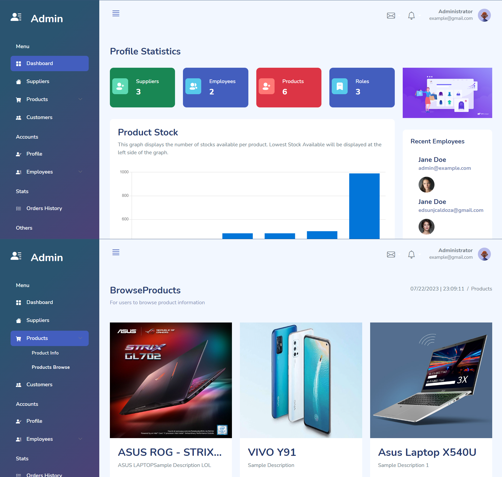

# 🛍️ Small-Medium Enterprise Purchase and Order System 📦

The Small-Medium Enterprise Purchase and Order System is a web application built using PHP scripting language that facilitates the management of product information, purchase history, and other essential functions for a small to medium-sized enterprise.

## ⭐️ Key Features

- 📦 Product Management: Store and organize detailed information about products, including product names, descriptions, pricing, and available stock.
- 📊 Purchase History: Track and maintain a comprehensive purchase history, recording purchases made by customers or other businesses.
- 📋 Order Processing: Efficiently process incoming orders and manage their status, ensuring smooth order fulfillment.
- 🔒 User Authentication: Securely authenticate users with login functionality to restrict access to authorized personnel only.

## 🚀 Getting Started

To run the Small-Medium Enterprise Purchase and Order System, follow these steps:

1. Clone the repository to your local web server or hosting environment.
2. Import the database schema provided in [sme-db.sql](database/sme-db.sql) to set up the necessary tables.
3. Configure the database connection in the project files, if required.
4. Access the application via your web browser and log in with appropriate credentials.

## 🛠 Technology Stack

- 🐘 PHP: The primary scripting language used to develop the Purchase and Order System.
- 🏢 MySQL: The database management system used to store product information, purchase history, and other data.
- 🌐 HTML: The markup language for creating the structure and content of web pages.
- 🎨 CSS: The style sheet language used to define the visual appearance of the application.
- 🅱️ Bootstrap: The front-end framework used to design responsive and mobile-friendly web pages.
- 🎉 JavaScript: The scripting language for front-end interactivity and dynamic features.

## 🤝 Contributing

Contributions, bug reports, and feature requests are welcome! Feel free to open an issue or submit a pull request.

## 📄 Project Structure

- [css/](assets/css/): Contains CSS stylesheets for the application's visual design.
- [js/](assets/js/): Contains JavaScript files for front-end interactivity, if applicable.
- [images/](assets/images/): Contains image assets used in the application, if applicable.
- [sme-db.sql](database/sme-db.sql): The SQL file with the database schema.

🛒 Start managing your enterprise's purchases and orders efficiently with this Purchase and Order System! 🛒
